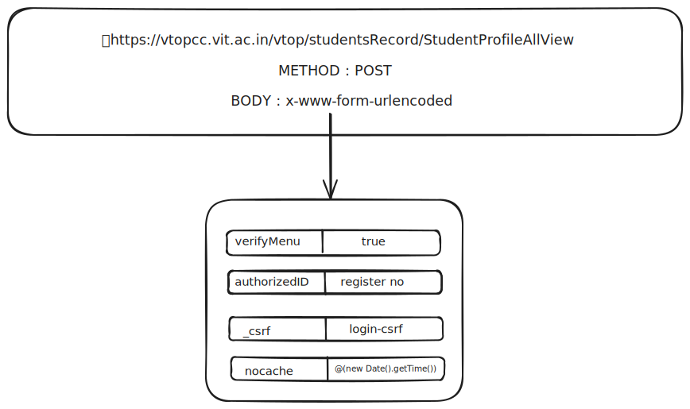

# VTOP Student Data Management API

This project provides a FastAPI-based backend for scraping, storing, and serving student data from the VIT VTOP portal. It is designed to automate the retrieval of student information such as profile, attendance, marks, timetable, and grade history, and make it accessible via RESTful API endpoints.

---

## Features

- **Automated Scraping**: Uses headless HTTP requests to log in and scrape student data from VTOP.
- **Session Management**: Handles sessions and CSRF tokens securely for each user.
- **Data Storage**: Persists all scraped data in a local SQLite database using SQLAlchemy ORM.
- **REST API**: Exposes endpoints for login, scraping, and fetching student data (profile, marks, attendance, timetable, etc.).
- **Periodic Cleanup**: Cleans up expired sessions automatically.
- **Modular Codebase**: Organized into routers, utilities, and scraping modules for maintainability.

---

## Architecture & Flow

Below are visual diagrams representing the workflow and endpoints of the project.
These diagrams illustrate the API flow, required parameters.

### 1. Login & Session Setup


---

### 2. Student Profile Scraping



---

### 3. Attendance Scraping


---

### 4. Grade History & CGPA


---

### 5. Semester Data


---

### 6. Marks Scraping


---

### 7. Timetable Scraping


---

## Project Structure

```
.
├── main.py                # FastAPI app entry point
├── database.py            # SQLAlchemy DB setup and session management
├── models.py              # SQLAlchemy ORM models
├── requirements.txt       # Python dependencies
├── routers/               # FastAPI routers (student, llm)
├── streamlit_app.py       # Streamlit UI for interacting with the application
├── utils/                 # Utility modules (session, scraping, validation)
│   └── scrape/            # HTML scraping logic for each VTOP page
├── html_content/          # Sample HTML files for development/testing
├── vtop_data.db           # SQLite database file
```

---

## How It Works


1. **Session Creation**:
   - A session is created for each student using their registration number.
   - Session and CSRF token are managed in-memory for secure requests.

2. **Login Flow**:
   - The API simulates the VTOP login process, including captcha handling and CSRF token management.
   - On successful login, a session is established for subsequent scraping.

3. **Scraping**:
   - The backend scrapes various VTOP pages (profile, attendance, marks, timetable, grade history) using BeautifulSoup.
   - Each type of data has a dedicated scraping module under `utils/scrape/`.

4. **Data Storage**:
   - Scraped data is stored in the `students` table in SQLite, with columns for each data type (profile, marks, etc.).

5. **API Endpoints**:
   - Endpoints are provided for session creation, login, scraping, and data retrieval.
   - Data can be fetched per student and per semester.

6. **Session Cleanup**:
   - Expired sessions are cleaned up every 10 minutes to free resources.

---

## API Usage

### Session & Login

- `POST /student/create_session?reg_no=22BCE1519`
  Creates a session for the given registration number.

- `POST /student/prepare_login`
  Prepares for login and returns captcha image.

- `POST /student/login`
  Logs in with registration number, password, and captcha.

- `GET /student/start-scraping?reg_no=22BCE1519`
  Scrapes all student data and stores it in the database.

- `GET /student/logout?reg_no=22BCE1519`
  Logs out and deletes all data for the student.

### Data Retrieval

- `GET /llm/profile?reg_no=22BCE1519`
  Returns the student's profile.

- `GET /llm/semesters?reg_no=22BCE1519`
  Returns all available semesters for the student.
  **Note:** The `sem_id` values required for other endpoints can be found in the response from this endpoint.

- `GET /llm/marks?reg_no=22BCE1519&sem_id=CH20242505`
  Returns marks for a specific semester.
  **If you omit the `sem_id` parameter, marks for all semesters will be returned.**

- `GET /llm/attendance?reg_no=22BCE1519&sem_id=CH20242505`
  Returns attendance for a specific semester.
  **If you omit the `sem_id` parameter, attendance for all semesters will be returned.**

- `GET /llm/timetable?reg_no=22BCE1519&sem_id=CH20242505`
  Returns timetable for a specific semester.
  **If you omit the `sem_id` parameter, timetable for all semesters will be returned.**

- `GET /llm/grade_history?reg_no=22BCE1519`
  Returns grade history.

> **Tip:**
> The `sem_id` parameter for marks, attendance, and timetable endpoints can be obtained from the `/llm/semesters` endpoint.
> If you do not provide a `sem_id`, the API will return data for all semesters.

---

## Setting up and Running the Streamlit Application

To set up and run the Streamlit application:

1. **Create a Virtual Environment**:
   ```bash
   python -m venv venv
   source venv/bin/activate  # On Windows use `venv\Scripts\activate`
   ```

2. **Install Dependencies**:
   ```bash
   pip install -r requirements.txt
   ```

3. **Run the Application**:
   ```bash
   streamlit run streamlit_app.py
   ```
   The application will be accessible at `http://localhost:8501`.


---

## Contributing

1. Fork the repository.
2. Create your feature branch (`git checkout -b feature/fooBar`).
3. Commit your changes.
4. Push to the branch (`git push origin feature/fooBar`).
5. Create a new Pull Request.

---


## Acknowledgements

- [FastAPI](https://fastapi.tiangolo.com/)
- [SQLAlchemy](https://www.sqlalchemy.org/)
- [BeautifulSoup](https://www.crummy.com/software/BeautifulSoup/)
- VIT VTOP (for the data source)

---
